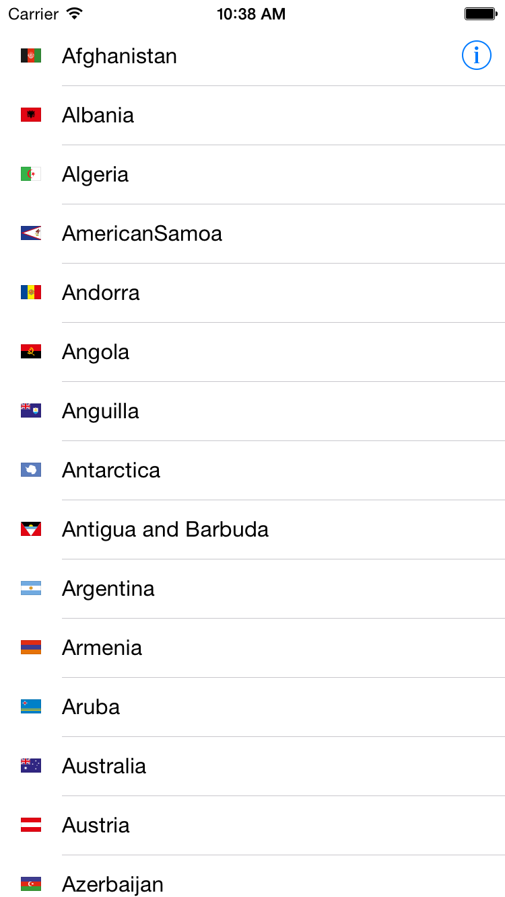
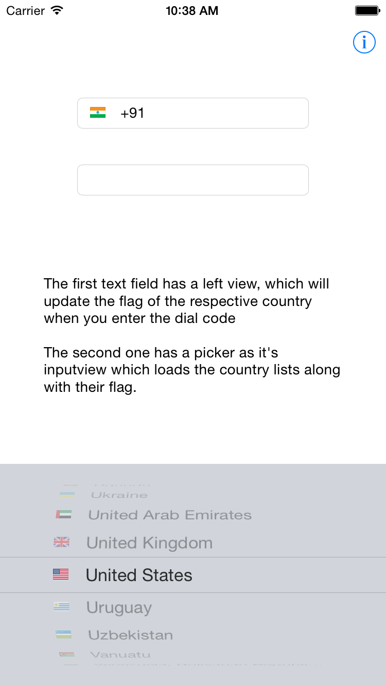

Purpose
--------
The project has a UIImage category named RSFlags, which will get you the flag icon for the given country code. The list of countries is based on the ISO 3166 country code standard (http://en.wikipedia.org/wiki/ISO_3166-1). 

The flags are retrived from a single sprite image which I got from Google image search. You dont have to include the flag images for each and every country. To make this work, you just have to include a single image, and a UIImage subclass from this project.

Supported SDK and OS Versions
-----------------------------
* Supported build target - iOS 8.1 (Xcode 6.1, Apple LLVM compiler 6.0)
* Deployment target - iOS 8.0 (Of course, you can change it)

Installation
-------------
    To use the Flags in your project, just drag the UIImage+RSFlags.h and .m file into your project and also drag the WorldFlags image from the image asset.

Usage
------
    The UIImage category has a method called,
+ (UIImage *)flagForCountryCode:(NSString *)countryCode
which will return you the flag image for the country code you pass.

    For example, the following call will return the flag for United States. Here "US" is the code for United States,
UIImage *flag = [UIImage flagForCountryCode:@"US"];

